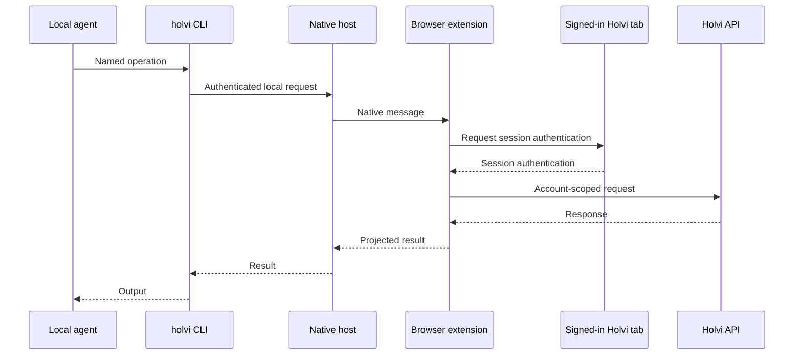

# Holvi Agent Bridge

`holvi-agent-bridge` lets local agents use selected Holvi features through a
signed-in browser session.

The Holvi session stays in the browser. Agents work through the native `holvi`
CLI instead of navigating the site. Each command performs a specific operation,
so you can choose which parts of Holvi the agent may use.

## How it works



Your Holvi sign-in stays in the browser, and the agent can use only the features
you enable.

## Features

- List and filter transactions for one Holvi payment account.
- View debt and bookkeeping details without exposing full API responses.
- List bookkeeping categories and suggestions for a debt.
- View a limited page of recent account activity, newest first.
- Preview receipt attachments, require confirmation before upload, and check the
  attachment count before and after the upload.
- Keep Holvi credentials in the browser and grant access one capability at a
  time.
- Install a skill for Claude Code, OpenCode, or Codex.

## Requirements

Runtime requirements:

- macOS or Linux
- Google Chrome, Brave, or another Chromium-based browser with native messaging
  support
- a Holvi account with access to the target company

Building from source requires Rust 1.85 or later. Extension development also
uses Bun and the dependencies in `package.json`.

## Getting started

### Install the `holvi` CLI

Install the latest release with the installation script:

```sh
curl -fsSL https://raw.githubusercontent.com/raine/holvi-agent-bridge/main/scripts/install | bash
```

Or install with Homebrew:

```sh
brew install raine/holvi-agent-bridge/holvi
```

### Teach a coding agent

Print the agent-facing CLI primer to standard output:

```sh
holvi skill
```

Install it into every detected coding-agent skill directory:

```sh
holvi skill install
```

Claude Code, OpenCode, and Codex are supported. Choose one or more explicit
targets when automatic detection is not appropriate:

```sh
holvi skill install --agent claude --agent codex
```

The installed skill explains how to check capabilities, tell payment and debt
UUIDs apart, keep read operations within their limits, and preview receipt
uploads before making changes.

### Configure Holvi

Sign in to Holvi in Chrome, then open the company group and its payment account
transaction feed. Copy these values:

- the full group URL, such as
  `https://account.app.holvi.com/group/AbC123+example-company/`
- the payment account UUID from the `payments-feed/<uuid>/` URL
- any local attachment directories the enabled capabilities may read

Register the native host with the capabilities required by the agent:

```sh
holvi install \
  --group-url 'https://account.app.holvi.com/group/AbC123+example-company/' \
  --account '11111111-1111-4111-8111-111111111111' \
  --capability transactions.read \
  --capability attachments.write \
  --receipt-root '/absolute/path/to/receipts'
```

A read-only installation omits `attachments.write` and does not need a receipt
root:

```sh
holvi install \
  --group-url 'https://account.app.holvi.com/group/AbC123+example-company/' \
  --account '11111111-1111-4111-8111-111111111111' \
  --capability transactions.read
```

The `holvi install` command prepares both parts of the bridge. Complete the
browser setup using the paths in its completion report:

1. Find the `extension files` path in the report. This is the unpacked extension
   directory containing `manifest.json`.
2. Open `chrome://extensions` in Google Chrome.
3. Enable **Developer mode**.
4. Choose **Load unpacked** and select the exact `extension files` directory.
5. Confirm that Chrome displays extension ID
   `oeedcemphbobfehfmcllmjhhhjgahgeb`.
6. Reload the signed-in Holvi group tab.

The command also registers the native host using the executable that ran
`holvi install`. The extension and native host are ready when `holvi doctor`
succeeds:

```sh
holvi doctor
```

## Capabilities

The private config lists the capabilities available to the agent.

| Capability          | Operations                                                           |
| ------------------- | -------------------------------------------------------------------- |
| `transactions.read` | Check the connection, list transactions, and inspect one transaction |
| `attachments.write` | Attach a local file after preflight checks and verify the result     |
| `bookkeeping.read`  | Inspect accounting details, categories, and category suggestions     |
| `audit.read`        | Inspect up to 25 recent pool activity entries                         |

`attachments.write` operations also require `transactions.read` because the
bridge checks attachment state immediately before and after a write.

Inspect the capabilities and operations enabled on a machine:

```sh
holvi capabilities
```

## Transaction and receipt workflow

List all transactions in a date range:

```sh
holvi transactions --from 2026-07-01 --to 2026-07-31 --json
```

Add `--missing-attachments` to return only transactions without an attachment:

```sh
holvi transactions --from 2026-07-01 --to 2026-07-31 \
  --missing-attachments --json
```

The JSON output reports Holvi's payment UUID and direct-match debt UUID as
separate fields. Settled transactions normally have a debt UUID. Pending
payments can have `null` until Holvi creates the debt record used for
attachments.

```sh
holvi preview \
  --debt '11111111-1111-4111-8111-111111111111'
```

Before uploading, run the command without `--yes`. It checks the transaction and
local file without changing Holvi:

```sh
holvi upload \
  --debt '11111111-1111-4111-8111-111111111111' \
  --file '/absolute/path/to/receipts/example.pdf'
```

Check the preview, then upload the file:

```sh
holvi upload \
  --debt '11111111-1111-4111-8111-111111111111' \
  --file '/absolute/path/to/receipts/example.pdf' \
  --yes
```

The bridge reads the transaction immediately before upload and refuses to
continue if any attachment exists. After Holvi accepts the file, it reads the
transaction again and succeeds only when the attachment count is exactly one.

## Bookkeeping and audit workflow

Enable `bookkeeping.read` or `audit.read` during installation to expose their
commands. These capabilities cover the configured Holvi pool, while
`transactions.read` remains restricted to the configured payment account.

View the accounting document and its active line items:

```sh
holvi bookkeeping get \
  --debt '11111111-1111-4111-8111-111111111111'
```

The result keeps unit prices separate from line totals and leaves Holvi's decimal
strings unchanged. It omits inactive records and records that are not line items,
and reports their number in `droppedItemCount`.

List category codes and request Holvi's ordered category suggestions for one
debt:

```sh
holvi bookkeeping categories
holvi bookkeeping suggestions \
  --debt '11111111-1111-4111-8111-111111111111'
```

Inspect up to 25 recent activity entries:

```sh
holvi audit list --limit 25
```

The audit command returns one page in newest-first order. It leaves out
polymorphic details, field changes, continuation URLs, and other response fields
that the command does not use.

## Command reference

| Command                                                     | Capability                                                 | Description                                       |
| ----------------------------------------------------------- | ---------------------------------------------------------- | ------------------------------------------------- |
| [`install`](#holvi-install)                                 | none                                                       | Configure the account and register the extension  |
| [`skill`](#holvi-skill)                                     | none                                                       | Print or install the coding-agent skill           |
| [`config edit`](#holvi-config-edit)                          | none                                                       | Open the private config in the user editor         |
| [`config path`](#holvi-config-path)                          | none                                                       | Print the private config path                      |
| [`capabilities`](#holvi-capabilities)                       | none                                                       | Show enabled capabilities and operations          |
| [`doctor`](#holvi-doctor)                                   | any configured capability                                  | Verify the Chrome connection and an API surface   |
| [`transactions`](#holvi-transactions)                       | `transactions.read`                                        | List payment-account transactions                 |
| [`preview`](#holvi-preview)                                 | `transactions.read`                                        | Inspect one accounting debt                       |
| [`upload`](#holvi-upload)                                   | `transactions.read`, plus `attachments.write` with `--yes` | Validate or upload one receipt                    |
| [`bookkeeping`](#holvi-bookkeeping)                         | `bookkeeping.read`                                         | Read bookkeeping details and category data        |
| [`bookkeeping get`](#holvi-bookkeeping-get)                 | `bookkeeping.read`                                         | Inspect bookkeeping details and active line items |
| [`bookkeeping categories`](#holvi-bookkeeping-categories)   | `bookkeeping.read`                                         | List bookkeeping categories                       |
| [`bookkeeping suggestions`](#holvi-bookkeeping-suggestions) | `bookkeeping.read`                                         | List suggested category codes for one debt        |
| [`audit`](#holvi-audit)                                     | `audit.read`                                               | Read recent account activity                      |
| [`audit list`](#holvi-audit-list)                           | `audit.read`                                               | List recent pool activity                         |

### `holvi install`

Writes the private config, installs the bundled extension files, and registers
the Chrome Native Messaging host. You can repeat `--capability` and
`--receipt-root`. The command keeps their original order and removes duplicates.
It also reuses an existing valid HMAC secret.

```sh
holvi install \
  --group-url URL \
  --account UUID \
  --capability CAPABILITY \
  [--capability CAPABILITY] \
  [--receipt-root /absolute/path] \
  [--json]
```

| Option                    | Required | Description                                         |
| ------------------------- | -------- | --------------------------------------------------- |
| `--group-url URL`         | yes      | Full `https://account.app.holvi.com/group/.../` URL |
| `--account UUID`          | yes      | Payment account UUID used by the transaction feed   |
| `--capability CAPABILITY` | yes      | Capability to enable, repeatable                    |
| `--receipt-root PATH`     | no       | Approved absolute attachment directory, repeatable  |
| `--json`                  | no       | Print the installation result as JSON               |

`attachments.write` requires at least one receipt root. The default report shows
the config path, stable extension ID, unpacked extension path, native host
manifest path, restart status, and next steps. Installation asks an idle native
host to restart with a signed request. The extension then reconnects to the
executable in the installed manifest. If the host is busy or does not support
restart control, the report shows `manualRequired`. Reload the unpacked extension
in `chrome://extensions` after each installation to activate the installed
JavaScript. Use `--json` to get the installation result as a JSON object.

### `holvi skill`

Prints the built-in instructions for coding agents. This command does not read
the bridge config or connect to Chrome.

```sh
holvi skill
```

Install the instructions as `SKILL.md` for any detected coding agents:

```sh
holvi skill install [--agent AGENT]...
```

`--agent` accepts `claude`, `opencode`, or `codex`, and you can pass it more than
once. Without `--agent`, the command looks for user-level agent directories and
workspace markers. It returns an error if it cannot find a supported agent. An
explicit target does not need to be detected first.

The user-level destinations are:

```text
~/.claude/skills/holvi/SKILL.md
~/.config/opencode/skills/holvi/SKILL.md
~/.codex/skills/holvi/SKILL.md
```

Installation creates any missing skill directories and replaces `SKILL.md` with
the copy built into the running `holvi` executable. Run the command again to
refresh the instructions.

### `holvi config edit`

Opens the private configuration file in the editor selected by `VISUAL`, then
`EDITOR`, with `vi` as the fallback. Editor values can include command-line
arguments, such as `VISUAL="code --wait"`. The command passes the resolved config
path to the editor and reports a failure when the editor exits unsuccessfully.

```sh
holvi config edit
```

Config editing derives the path independently of config contents, which allows
the editor to repair an invalid configuration file.

### `holvi config path`

Prints the private configuration file path. Path resolution works before the file
exists and is independent of its contents.

```sh
holvi config path
```

Both config commands honor `HOLVI_AGENT_BRIDGE_CONFIG`. Otherwise they use the
platform path described in [Local files](#local-files).

### `holvi capabilities`

Prints a status report for every supported capability and known operation. An
operation is enabled only when all of its required capabilities are enabled.

```sh
holvi capabilities [--json]
```

The default report uses aligned status rows for quick terminal scanning. Use
`--json` to print the configured capability list and operation status map for
scripts. This command reads and validates the private config but does not connect
to Chrome or Holvi.

### `holvi doctor`

Checks the config, Native Messaging connection, protocol compatibility, host and
extension build versions, open Holvi tab, session authentication, account scope,
capabilities, and one API endpoint.

```sh
holvi doctor [--json]
```

Probe priority is transactions, bookkeeping categories, then audit activity. A
write-only capability set verifies authentication and reports that an API probe
requires a read capability. The default report groups connection, account,
capability, and probe status into aligned terminal sections. Use `--json` to get
the same result as JSON, including `probeAction`, account scope, and capability
metadata.

### `holvi transactions`

Lists payment-feed records from the configured payment account. The bridge reads
API pages up to the configured limits and applies date filtering locally.

```sh
holvi transactions \
  [--from YYYY-MM-DD] \
  [--to YYYY-MM-DD] \
  [--missing-attachments] \
  [--json]
```

| Option                  | Description                                           |
| ----------------------- | ----------------------------------------------------- |
| `--from YYYY-MM-DD`     | Include transactions on or after this calendar date   |
| `--to YYYY-MM-DD`       | Include transactions on or before this calendar date  |
| `--missing-attachments` | Request only transactions without attachments         |
| `--json`                | Print the complete JSON projection instead of a table |

`--from` must be on or before `--to`. With no dates, the command lists every
transaction available within the configured page and result limits. JSON keeps
`paymentUuid` and the direct-match `debtUuid` separate.

### `holvi preview`

Reads one debt record directly from Holvi and prints the compact view used by
the receipt workflow.

```sh
holvi preview --debt UUID
```

The result includes the debt UUID, object code, counterparty, amount, currency,
attachment count, and bookkeeping status. `--debt` must be a UUID.

### `holvi upload`

Validates a receipt path and either prints a dry-run or uploads the file.

```sh
holvi upload --debt UUID --file /absolute/path/to/receipt.pdf [--yes]
```

| Option        | Required | Description                                   |
| ------------- | -------- | --------------------------------------------- |
| `--debt UUID` | yes      | Debt that receives the attachment             |
| `--file PATH` | yes      | Absolute path under an approved receipt root  |
| `--yes`       | no       | Perform the upload after all preflight checks |

Without `--yes`, the command reads the debt and prints `dryRun`, `transaction`,
`receipt`, and `next` fields without modifying Holvi. With `--yes`, the
extension requires zero existing attachments, uploads the file, and verifies
that the resulting attachment count is exactly one.

Accepted files are nonempty PDF, PNG, JPEG, or GIF files within the configured
size limit. Canonical path checks reject relative paths and symlink escapes.

### `holvi bookkeeping`

Groups the commands that read bookkeeping details and category data.

```sh
holvi bookkeeping <COMMAND>
```

### `holvi bookkeeping get`

Reads the accounting document for a debt directly from Holvi and returns a fixed
set of JSON fields.

```sh
holvi bookkeeping get --debt UUID
```

The result includes debt identity, booking and workflow metadata, attachment
count, and active line items. Each line item separates `unitPrice` from
`lineTotal`. Inactive and non-line-item records contribute to
`droppedItemCount`. The returned debt UUID must match the requested UUID.

### `holvi bookkeeping categories`

Lists the pool's bookkeeping categories as JSON.

```sh
holvi bookkeeping categories
```

Each result contains a required `code` and optional `handle` and `label`.
Unprojected category fields do not cross the extension boundary.

### `holvi bookkeeping suggestions`

Lists Holvi's ordered category suggestions for one debt.

```sh
holvi bookkeeping suggestions --debt UUID
```

The JSON result contains `debtUuid` and `categoryCodes`. The command converts
suggestion records to category codes, returns at most 100, and rejects unknown
item shapes.

### `holvi audit`

Groups the commands that read recent account activity.

```sh
holvi audit <COMMAND>
```

### `holvi audit list`

Lists up to 25 recent activity entries for the configured pool.

```sh
holvi audit list [--limit LIMIT]
```

`--limit` accepts values from 1 through 25 and defaults to 25. The result
contains `returnedCount`, `hasMore`, an `order` value of `newest-first`, and
scalar activity entries. The extension verifies timestamp ordering and omits the
backend continuation URL, structured content, details, summaries, and field
changes.

### Common command behavior

- `-h` and `--help` print help for the selected command.
- Commands with JSON output write formatted JSON to standard output.
- Human-readable transaction output uses a fixed-width table unless `--json` is
  present.
- Validation, authorization, Chrome connection, timeout, and Holvi API errors go
  to standard error and produce a nonzero exit status.
- Commands that contact Holvi require the configured signed-in group tab to
  remain open in Chrome.

## Security model

The Holvi session stays in Chrome. The content script reads Holvi's JWT only when
the extension asks for it. The token never leaves the extension. It is not sent
to the native host, CLI, terminal, config file, or attachment directory.

The private config selects the account. At runtime, the native host sends the
group segment, API pool handle, payment account UUID, and enabled capabilities
to the extension. The extension accepts authentication only from a tab whose
full group segment matches the config.

The native host checks each command against its required capabilities before
sending it to Chrome. The extension checks again before calling Holvi. Unknown
commands and capabilities are rejected.

Agents call named operations rather than arbitrary HTTP endpoints. API paths and
methods live in the extension and cannot be supplied by the CLI caller.

The config lists the local directories available for attachments. Files must
resolve inside one of these directories. The bridge checks that each path is
absolute, stays inside the directory after canonicalization, points to a regular
and readable file, has an accepted media type, and fits the size limit.

The installer creates a random HMAC secret in a `0600` config file. CLI requests
are signed, expire after 30 seconds, and include replay-protected nonces. The
native host listens on a user-owned `0600` Unix socket and accepts only the
configured extension origin.

These checks separate the browser, local agent, Holvi account, and approved local
files. A process running as the same operating-system user can already read that
user's files and browser profile.

## Local files

On macOS, files live at:

```text
~/Library/Application Support/Holvi Agent Bridge/config.json
~/Library/Application Support/Holvi Agent Bridge/extension/
~/Library/Application Support/Google/Chrome/NativeMessagingHosts/app.holvi_agent_bridge.json
```

On Linux, equivalent files live under the XDG config directory and Google Chrome
native messaging directory.

`holvi install` updates existing installations in place. It reuses a valid `0600`
HMAC secret and updates the account, capabilities, receipt roots, extension, and
native host manifest.

## Native architecture

One Rust executable has two entry points:

- normal invocation provides the `holvi` CLI
- Chrome invocation with the allowlisted extension origin runs the Native
  Messaging host

The host handles the authenticated Unix socket, capability checks, nonce cache,
request timeout, and Native Messaging frames. During the handshake, it sends its
it sends its protocol and build versions. The extension rejects incompatible
protocols and includes its build version in `holvi doctor` output. A signed
`host.restart` request tells the extension to disconnect and reconnect its Native
Messaging port.

Uploads are split into 480 KiB chunks and checked end to end with SHA-256. The
default size limit is 25 MiB. Uploads also require confirmation and attachment
checks before and after the write.

The compiled extension files live in `assets/extension` so `cargo install` and
Nix packages can embed them. `src/extension` remains the TypeScript source of
truth. `bun run sync:artifacts` rebuilds the extension and refreshes the
embedded files. The check suite rejects differences between source builds and
embedded artifacts.

## Holvi API surfaces

The capabilities use these Holvi application endpoints:

```text
GET  /api/pool/{poolHandle}/ux/payments-feed/
GET  /api/pool/{poolHandle}/debt/{debtUuid}/
GET  /api/pool/{poolHandle}/debt/{debtUuid}/haip/bookkeeping-suggestions/
GET  /api/pool/{poolHandle}/category/
GET  /api/pool/{poolHandle}/log-feed/
POST /api/pool/{poolHandle}/attachment/formpost/
```

These are application endpoints rather than a supported public API. Holvi can
change them without notice. Keep dry runs and the check suite in the workflow
when updating the bridge.

## Development

Install the extension dependencies and run the full check suite:

```sh
bun install --frozen-lockfile
just check
```

`just check` delegates to `checkle run all`. Checkle verifies Rust formatting,
Clippy, compilation, builds, Rust tests, extension type checking, extension
tests, linting and formatting, and embedded artifact consistency.

Useful focused commands:

```sh
checkle run rust
checkle run extension
cargo test protocol
bun run sync:artifacts
```
